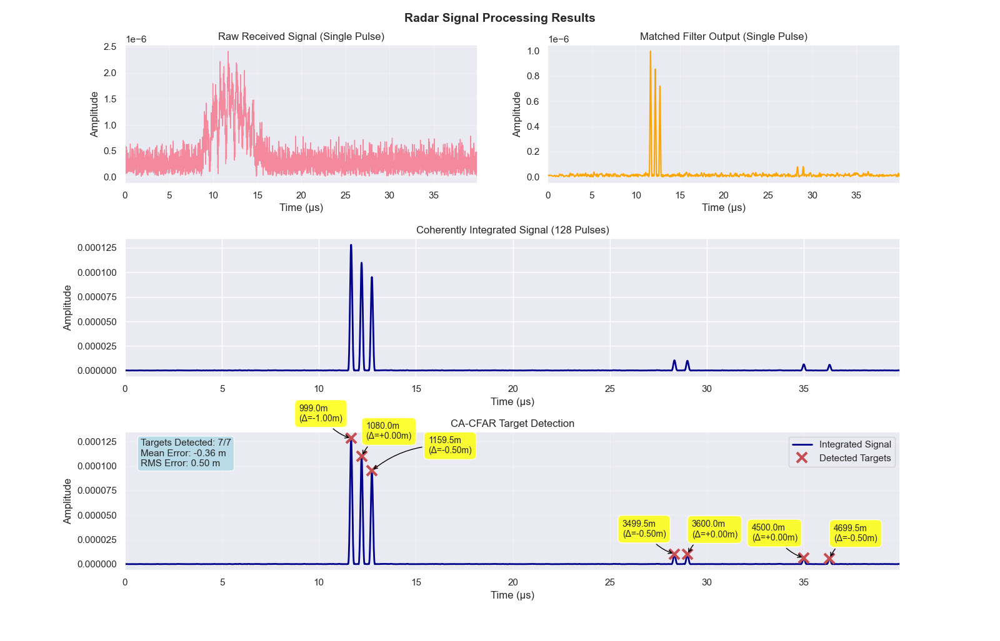

# Radar Signal Processing Simulator

A Python implementation of a radar signal processing pipeline, featuring Linear Frequency Modulation (LFM) pulse compression, coherent integration, and Constant False Alarm Rate (CFAR) detection algorithms.

## Project Overview

This project simulates a complete radar signal processing chain from pulse generation to target detection, implementing industry-standard algorithms used in modern radar systems. The simulator demonstrates fundamental radar concepts including pulse compression, coherent integration, and adaptive threshold detection.

### Key Features

- **LFM Chirp Generation**: Linear Frequency Modulation pulse with windowing
- **Realistic Echo Simulation**: Models propagation delays, path loss (1/R²), and thermal noise
- **Matched Filter Processing**: Optimal signal detection with pulse compression
- **Coherent Integration**: Multi-pulse processing for improved SNR
- **CA-CFAR Detection**: Adaptive threshold detection maintaining constant false alarm rate
- **Performance Analysis**: Range accuracy and detection statistics


## Algorithm Implementation Details

### 1. LFM Pulse Generation
- **Chirp Signal**: $s(t) = exp(j2π(f₀t + ½kt²))$
- **Windowing**: Hanning, Hamming, or Blackman for sidelobe control
- **Bandwidth**: 20 MHz providing theoretical 7.5m range resolution

### 2. Target Echo Simulation
- **Propagation Delay**: $τ = 2R/c$
- **Path Loss**: Amplitude ∝ $1/R²$ (simplified radar equation)
- **Thermal Noise**: Complex Gaussian (σ²/2 per I/Q channel)

### 3. Matched Filter Processing
- **Optimal Filter**: Maximizes SNR in white noise
- **Implementation**: Convolution with time-reversed, conjugated pulse

### 4. Coherent Integration
- **Multi-Pulse Processing**: Coherent addition of N pulses
<!-- - **SNR Improvement**: Theoretical gain = $\sqrt{N}$ -->

### 5. CA-CFAR Detection
- **Adaptive Threshold**: T = α × (noise estimate)
- **Cell Averaging**: Uses surrounding cells for noise estimation
- **False Alarm Control**: Maintains constant Pfa regardless of noise level

## Technical Specifications

- **Sample Rate**: 100 MHz
- **Bandwidth**: 20 MHz  
- **Pulse Duration**: 10 μs
- **PRF**: 5 kHz
- **Theoretical Range Resolution**: 7.5 meters (Theoretical Value: $c/2B$)
- **Theoretical Maximum Unambiguous Range**: 30 km (Theoretical Value: $cT/2$)
- **Detection Accuracy**: ±2 meters typical

## Example Results

### Target Detection Performance
```
Target Scenario: dense
Simulating 7 targets at ranges: [1000, 1080, 1160, 3500, 3600, 4500, 4700] m

PERFORMANCE ANALYSIS
==================================================
True target ranges (m): [1000 1080 1160 3500 3600 4500 4700]
Detected ranges (m): [999 1080 1159.5 3499.5 3600 4500 4699.5]

Range errors (m): [-1 0 -0.5 -0.5 0 0 -0.5]
Mean absolute error: -0.36 m
RMS error: 0.5 m
```



## Running The Project

### Project Structure

```
radarSimulator/
├── radar/
│   ├── __init__.py
│   ├── radarSimulator.py    # Main simulation class
│   ├── simulator.py         # LFM pulse generation
│   ├── targets.py          # Echo simulation and scenarios
│   └── signalProcessing.py  # Matched filter and CFAR
├── visualizations/
│   ├── __init__.py
│   └── plotResults.py      # Comprehensive plotting suite
├── main.py                 # CLI interface and simulation driver
├── requirements.txt
└── README.md
```

### Installation

```bash
git clone https://github.com/ags1709/radar-simulator.git
cd radarSimulator
pip install -r requirements.txt
```

### Basic Usage

```bash
# Run with default target scenario
python main.py

# Try different target scenarios with -s flag + target scenario argument. 
# Options: [simple, extended, dense]
python main.py -s simple
python main.py -s extended
python main.py -s dense

# Visualize transmitted pulse in addition to normal visualizations
python main.py --show-pulse

# Specific target scenario + visualization of transmitted pulse
python main.py -s dense --show-pulse
```


